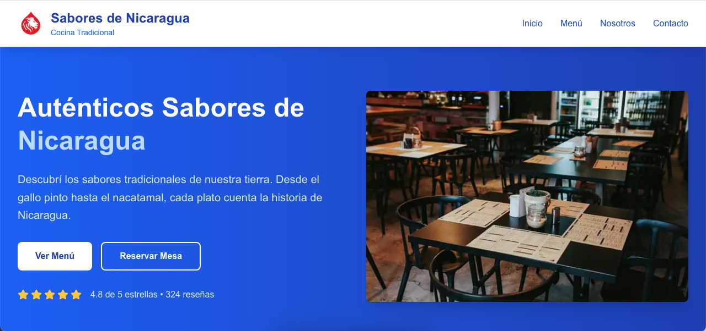

# 🍽️ Restaurante Demo – Nicaragua  [ES - 🇳🇮]

[](https://nextjs.org/)  
[](https://tailwindcss.com/)  
[](https://www.typescriptlang.org/)  
[](https://vercel.com/)  
[]()  

Este proyecto es una **página web demo para un restaurante nicaragüense**, desarrollada con **Next.js**.  
Forma parte de mi portafolio como desarrollador web y sirve como ejemplo de una plantilla que puede adaptarse para negocios gastronómicos en Nicaragua o en cualquier parte del mundo.  

👉 **Demo en línea:** [https://restaurante-demo.vercel.app](https://nicaraguan-restaurant-demo.vercel.app)  

---

## 🚀 Tecnologías utilizadas
- [Next.js](https://nextjs.org/) – Framework de React  
- [Tailwind CSS](https://tailwindcss.com/) – Estilos modernos y responsivos  
- [TypeScript](https://www.typescriptlang.org/) – Tipado seguro  
- [Vercel](https://vercel.com/) – Hosting y despliegue  

---

## ✨ Características principales
- Diseño **moderno y responsivo** (móvil, tablet y desktop)  
- Sección de **menú de platos** con imágenes atractivas  
- Hero principal con foto del restaurante  
- **CTA** para reservar o contactar  
- Código limpio y fácil de personalizar  

---

## 📷 Vista previa


---

# 🍽️ Restaurant Demo – Nicaragua [EN]
[](https://nextjs.org/)  
[](https://tailwindcss.com/)  
[](https://www.typescriptlang.org/)  
[](https://vercel.com/)  
[]()

This project is a demo website for a Nicaraguan restaurant, built with Next.js.
It is part of my portfolio as a web developer and serves as an example template that can be adapted for restaurants or food businesses in Nicaragua or anywhere in the world.

👉 **Live Demo:** [https://restaurant-demo.vercel.app](https://nicaraguan-restaurant-demo.vercel.app)

---

 ## 🚀 Technologies Used
 – [Next.js](https://nextjs.org/) - React Framework  
 – [Tailwind CSS](https://tailwindcss.com/) – Modern, responsive styling   
 – [TypeScript](https://www.typescriptlang.org/) – Strong typing   
 – [Vercel](https://vercel.com/) – Hosting and deployment   

---

---
## ✨ Main Features

- Modern, **responsive design** (mobile, tablet, desktop)
- Menu section with attractive **food images**
- Hero section with restaurant photo
- **Call-to-action** (CTA) for booking/contact
- Clean, customizable code
---

## 📷 Preview


---

## ⚡ Cómo ejecutar en local - ⚡ Run Locally
```bash
git@github.com:Luis93Hub/Nicaraguan-Restaurant---Demo.git
cd restaurante-demo
npm install
npm run dev
```
Abre <http://localhost:3000> en tu navegador.

Open <http://localhost:3000> in your browser.


👨‍💻 Autor - 👨‍💻 Author

Desarrollado por [Drunic - Luis Hernandez] -- Developed by [Drunic - Luis Hernandez]

## 📄 License
Este proyecto es solo un demo de portafolio y no está pensado para uso comercial directo sin personalización.

This project is a portfolio demo only and not intended for direct commercial use without customization.
